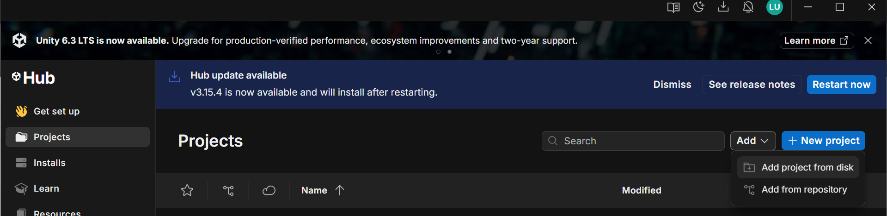
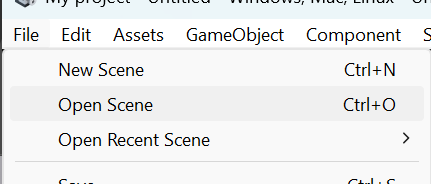
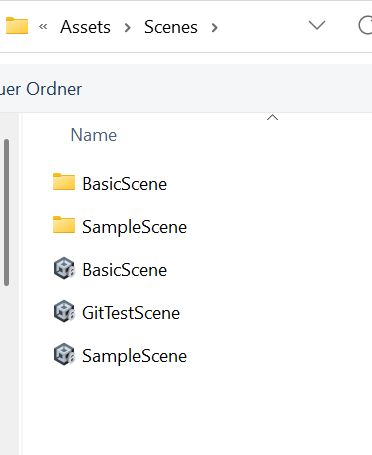

# Installationsanleitung

## Software Voraussetzungen

- Unity Version 6.3 (LTS): Download [Unity Hub](https://unity.com/de/download)

## Anleitung

### First-Time Setup

1. vb-app-Repository klonen:

```bash
# HTTPS
git clone https://gitlab.dit.htwk-leipzig.de/virtuelle-buehne/vb-app.git
cd vb-app
```

```bash
# or SSH
git clone git@gitlab.dit.htwk-leipzig.de:virtuelle-buehne/vb-app.git
cd vb-app
```

2. Im Unity-Hub über `Projects > Add > Add project from disk` das Projekt unter `vb-app` hinzufügen

{width=900 height=221}

3. `Projects > My project` in Unity Hub öffnen (Unity Engine startet, längere Ladezeiten sind normal)

4. Zum Überprüfen, ob das richtige Projekt geladen wurde, die Szene `My project > Assets > Scenes > GitTestScene` laden über `File > Open Scene`

{width=324 height=138}

{width=279 height=342}

### Daily Development Workflow

1. `Projects > My project` in Unity Hub öffnen

2. In `My project > Assets > Scripts` können C#-Skripte für die Szenen gelegt werden.

> 💡 **WICHTIG**
> Beim Wechseln eines Branches in Git muss zwischendurch Unity geschlossen werden
